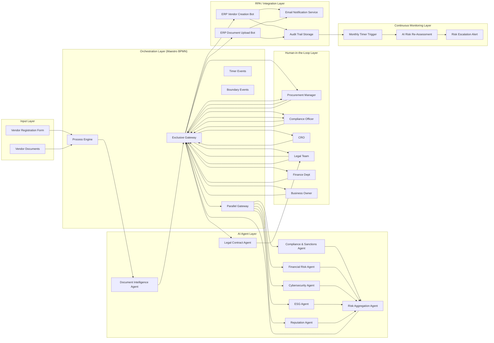

# 🏛️ VendorTrust AI — Intelligent Vendor Onboarding & Risk Management

> **UiPath Hackathon Submission** | Built on UiPath Maestro BPMN · Process Orchestration · AI Agents · RPA

---

## 📋 Table of Contents

1. [Project Description](#project-description)
2. [Problem Statement](#problem-statement)
3. [What We Built](#what-we-built)
4. [Process Flow Overview](#process-flow-overview)
5. [UiPath Components Used](#uipath-components-used)
6. [Agent Type](#agent-type)
7. [Architecture Diagram](#architecture-diagram)
8. [Setup Instructions](#setup-instructions)
9. [How to Test](#how-to-test)
10. [Key Scenarios & Edge Cases](#key-scenarios--edge-cases)
11. [Project Structure](#project-structure)

---

## 📌 Project Description

**VendorTrust AI** is an end-to-end, AI-powered **Vendor Onboarding and Risk Management** platform built entirely on UiPath's Agentic Automation stack. It replaces a traditionally slow, error-prone, manual vendor registration process with a fully automated, intelligent orchestration workflow that:

- **Validates vendor documents** using AI document intelligence
- **Assesses multi-dimensional risk** in parallel (compliance, financial, cybersecurity, ESG, reputation) using five dedicated AI agents running simultaneously
- **Routes decisions** to the right human reviewer based on calculated risk score (0–100 scale)
- **Analyses contracts** via an AI legal agent before routing through a 5-stage approval chain
- **Creates vendor master records** in ERP via RPA bots automatically once approved
- **Monitors vendor risk continuously** post-onboarding with a recurring AI re-assessment subprocess

---

## 🔴 Problem Statement

Onboarding a new vendor in a mid-to-large enterprise is a deeply broken process:

| Pain Point | Current Reality |
|---|---|
| **Slow & Manual** | 4–12 weeks of back-and-forth emails, spreadsheets, and PDF reviews |
| **Inconsistent Risk Checks** | Different reviewers apply different criteria — no standardised scoring |
| **Siloed Departments** | Compliance, Legal, Finance, Procurement work sequentially, not in parallel |
| **No Fraud Detection** | Fraudulent vendors slip through because no system cross-checks all signals |
| **No Post-Onboarding Monitoring** | Vendor risk is assessed once at onboarding, then forgotten |
| **ERP Data Entry Errors** | Manual data entry into ERP systems causes duplicates and mismatches |
| **Missed SLAs** | Approvers are not reminded, causing bottlenecks and missed deadlines |

These inefficiencies cost enterprises millions in regulatory fines, supply chain disruptions, and fraud losses every year.

---

## 🚀 What We Built

VendorTrust AI solves every one of these pain points through a single, unified BPMN orchestration process:

### Phase 1 — Document Collection & Deduplication
- Vendor submits a registration form with supporting documents
- System receives and stores all vendor documents
- **Automatic duplicate vendor detection** — flags and rejects duplicates before any processing begins

### Phase 2 — AI Document Intelligence
- An **AI Document Intelligence Agent** processes all submitted documents (OCR, extraction, validation)
- If documents are incomplete → vendor is automatically notified and given **5 business days** to resubmit
- If OCR fails → the system logs the failure and escalates to a **Manual Document Review** task for a human operator
- Once complete and valid, the process advances to risk assessment

### Phase 3 — Parallel AI Risk Assessment (5 Agents Simultaneously)
Five dedicated AI agents run **in parallel** — dramatically reducing turnaround from days to minutes:

| AI Agent | What It Checks |
|---|---|
| **Compliance & Sanctions Check Agent** | Sanctions lists, regulatory blacklists, PEP databases. Has fallback to a secondary API on failure |
| **Financial Risk Analysis Agent** | Credit ratings, financial statements, insolvency indicators, payment history |
| **Cybersecurity Assessment Agent** | Vendor's security posture, known CVEs, data breach history |
| **ESG Assessment Agent** | Environmental, Social & Governance scores, sustainability certifications |
| **Reputation & Media Analysis Agent** | News sentiment, adverse media, litigation history |

### Phase 4 — Risk Aggregation & Scoring
- A **Risk Aggregation AI Agent** consolidates all five parallel scores
- The system **categorises** the vendor into one of four risk tiers:
  - 🟢 **Low Risk (0–25)** → Automatically proceeds to contract review
  - 🟡 **Medium Risk (26–50)** → Procurement Manager review required
  - 🟠 **High Risk (51–75)** → Compliance Officer review required
  - 🔴 **Critical Risk (76–100)** → Chief Risk Officer (CRO) escalation required
- A **Risk Explanation Report** is generated automatically for reviewers
- **Fraud detection gateway** — if fraud indicators are found, immediate escalation to CRO for investigation

### Phase 5 — Human-in-the-Loop Review
- The appropriate reviewer (based on risk tier) gets a structured task with the AI-generated report
- Reviewer can: **Approve**, **Reject**, or **Request Additional Information**
- If additional info is requested → vendor has **3 days** to respond, then risk re-aggregation runs again

### Phase 6 — AI Legal Contract Analysis
- An **AI Legal Contract Analysis Agent** reviews all vendor contracts for red-flag clauses, missing terms, and compliance requirements
- Output is presented to the **Legal Team** for final contract sign-off
- If revisions are needed → contract revision loop with the vendor

### Phase 7 — 5-Stage Sequential Approval Chain
Each stage has **48-hour automatic reminders** and escalation on non-response:

```
Procurement Department → Finance Department → Compliance Department → Legal Department → Business Owner
```

Any single rejection ends the process with a formal rejection notice to the vendor.

### Phase 8 — ERP Integration via RPA
Once fully approved:
1. **RPA Bot** creates the Vendor Master Record in ERP
2. **RPA Bot** uploads all compliance and contract documents to ERP
3. System **generates a unique Vendor ID**
4. Automatic retry logic (30-minute wait + retry, then manual intervention if retry fails)

### Phase 9 — Parallel Stakeholder Notifications
All five stakeholders are notified simultaneously:
- Vendor (onboarding complete + Vendor ID)
- Procurement Team (vendor ready for use)
- Finance Team (payment setup ready)
- Compliance Team (vendor approved and logged)
- Business Owner (vendor successfully onboarded)

### Phase 10 — Audit Trail & Continuous Monitoring
- **Complete audit trail** and compliance log stored
- **Continuous Monitoring Subprocess** triggers monthly/quarterly/annual AI risk re-assessments
- If vendor risk level increases → automatic escalation and full reassessment workflow is triggered

---

## 🔄 Process Flow Overview

```mermaid
flowchart TD
    A[Vendor Application Received] --> B[Submit Vendor Registration Form]
    B --> C[Receive & Store Vendor Documents]
    C --> D{Duplicate Vendor Detected?}
    D -->|YES| E[Flag Duplicate & Notify] --> F[Duplicate Rejected]
    D -->|NO| G[AI Document Intelligence Agent]
    G --> H{Documents Complete & Valid?}
    H -->|NO| I[Notify Vendor Missing Docs] --> J[Wait 5 Business Days] --> K[Vendor Uploads Missing Docs] --> G
    H -->|YES| L[Start Parallel Risk Assessment]
    L --> M[Compliance & Sanctions Check]
    L --> N[Financial Risk Analysis]
    L --> O[Cybersecurity Assessment]
    L --> P[ESG Assessment]
    L --> Q[Reputation & Media Analysis]
    M & N & O & P & Q --> R[All Risk Assessments Complete]
    R --> S[Risk Aggregation AI Agent]
    S --> T[Categorize Vendor Risk Level]
    T --> U[Generate Risk Explanation Report]
    U --> V{Fraud Indicators Detected?}
    V -->|YES| W[Immediate Fraud Alert] --> X[CRO Fraud Investigation] --> Y{Fraud Confirmed?}
    Y -->|YES| Z[Vendor Flagged for Fraud & Rejected]
    Y -->|NO| AA[Risk Level Routing]
    V -->|NO| AA
    AA -->|Low Risk (0-25)| AB[Proceed to Contract Review]
    AA -->|Medium Risk (26-50)| AC[Procurement Manager Review] --> AD{Human Review Decision}
    AA -->|High Risk (51-75)| AE[Compliance Officer Review] --> AD
    AA -->|Critical Risk (76-100)| AF[CRO Escalation Review] --> AD
    AD -->|Reject| AG[Send Vendor Rejection Notice] --> AH[Vendor Application Rejected]
    AD -->|Request Info| AI[Request Additional Info] --> AJ[Wait 3 Days] --> AK[Vendor Submits Info] --> S
    AD -->|Approve| AB
    AB --> AL[AI Legal Contract Analysis Agent]
    AL --> AM[Legal Team Contract Review]
    AM --> AN{Contract Acceptable?}
    AN -->|NO| AO[Request Contract Revisions] --> AL
    AN -->|YES| AP[Procurement Dept Approval]
    AP --> AQ{Procurement Approved?} -->|NO| AR[Vendor Rejected at Procurement]
    AQ -->|YES| AS[Finance Dept Approval]
    AS --> AT{Finance Approved?} -->|NO| AU[Vendor Rejected at Finance]
    AT -->|YES| AV[Compliance Dept Final Approval]
    AV --> AW{Compliance Approved?} -->|NO| AX[Vendor Rejected at Compliance]
    AW -->|YES| AY[Legal Dept Approval]
    AY --> AZ{Legal Approved?} -->|NO| BA[Vendor Rejected at Legal]
    AZ -->|YES| BB[Business Owner Final Approval]
    BB --> BC{Business Owner Approved?} -->|NO| BD[Vendor Rejected by Business Owner]
    BC -->|YES| BE[RPA Bot: Create Vendor Master Record in ERP]
    BE --> BF[RPA Bot: Upload All Documents to ERP]
    BF --> BG[Generate Unique Vendor ID]
    BG --> BH{ERP Creation Successful?}
    BH -->|NO| BI[Log ERP Failure & Schedule Retry] --> BJ[Wait 30 Minutes] --> BK[Retry ERP Vendor Creation] --> BH
    BK -->|Retry Fails| BL[Manual ERP Intervention Required] --> BH
    BH -->|YES| BM[Send Stakeholder Notifications]
    BM --> BN[Store Complete Audit Trail & Compliance Log]
    BN --> BO[Vendor Successfully Onboarded & Active]
    BN --> BP[Start Continuous Monitoring Subprocess]
    BP --> BQ[Monthly AI Risk Re-Assessment]
    BQ --> BR{Risk Level Changed?}
    BR -->|NO| BS[Monitoring Cycle Complete - Reschedule]
    BR -->|YES| BT[Generate Risk Escalation Alert] --> BU[Trigger Full Vendor Reassessment]
```

---

## 🧩 UiPath Components Used

| Component | Purpose in This Solution |
|---|---|
| **UiPath Maestro BPMN** | Core process orchestration engine — the entire vendor onboarding flow is modelled as a BPMN 2.0 process with gateways, parallel branches, timers, boundary events, and a subprocess |
| **UiPath Process Orchestration** | Entry point trigger (`Vendor Application Received`) and process lifecycle management |
| **AI Document Intelligence Agent** | OCR + extraction + validation of vendor submitted documents |
| **AI Risk Assessment Agents (×5)** | Parallel compliance, financial, cybersecurity, ESG, and reputation analysis |
| **AI Risk Aggregation Agent** | Consolidates multi-dimensional risk scores into a single 0–100 score |
| **AI Legal Contract Analysis Agent** | Reviews vendor contracts for red flags and compliance gaps |
| **RPA Bots (×2)** | ERP integration: vendor master record creation + document upload |
| **Human-in-the-Loop (HITL) Tasks** | Manual review gates for Procurement, Finance, Compliance, Legal, and Business Owner approvals |
| **Timer Events** | SLA enforcement: 5-day document resubmission, 3-day info request, 48-hour approval reminders, 30-minute ERP retry |
| **Boundary Events** | Error handling for OCR failures, sanctions API failures, and approval timeouts |
| **Event Subprocess** | Continuous vendor monitoring with monthly/quarterly/annual re-assessment triggers |
| **Exclusive Gateways** | Risk-based routing, fraud detection branching, approval decision routing, ERP retry logic |
| **Parallel Gateways** | Splits for parallel risk assessment and parallel stakeholder notifications |
| **Integration Service Connectors** | Email notifications, ERP API calls, sanctions database lookups |

---

## 🤖 Agent Type

This solution utilises **both Coded Agents and Low-code Agents**:

- **Coded Agents**: The five parallel risk assessment agents (Compliance, Financial, Cybersecurity, ESG, Reputation) and the Risk Aggregation agent are implemented as coded AI agents with custom logic for score calculation, API integration, and error handling
- **Low-code Agents**: The AI Document Intelligence Agent and AI Legal Contract Analysis Agent are configured as low-code agents within the BPMN process, leveraging UiPath's built-in AI capabilities with minimal custom code
- **RPA Bots**: Two dedicated RPA bots handle ERP system integration for vendor master record creation and document uploads

---

## 🏗️ Architecture Diagram



---

## ⚙️ Setup Instructions

### Prerequisites
- UiPath Cloud account with **Maestro** and **Process Orchestration** enabled
- UiPath Studio Web access
- UiPath Orchestrator tenant with appropriate permissions

### Step 1 — Import the BPMN Project
1. Open **UiPath Studio Web**
2. Navigate to the solution workspace
3. Import or open the `Maestro BPMN` project containing `Process.bpmn`

### Step 2 — Configure Entry Point
The process entry point is already configured in `entry-points.json`:
- **Entry Point ID**: `e6d9e517-93d0-46ef-b0d4-0e62e41b84c2`
- **Trigger**: `Vendor Application Received`
- **Type**: ProcessOrchestration

### Step 3 — Bind AI Agents
For each of the following service tasks in the BPMN, bind the corresponding AI agent:
| BPMN Task | Agent to Bind |
|---|---|
| `task_ai_agent` | AI Document Intelligence Agent |
| `task_compliance_check` | Compliance & Sanctions Check Agent |
| `task_financial_risk` | Financial Risk Analysis Agent |
| `task_cyber_assessment` | Cybersecurity Assessment Agent |
| `task_esg_assessment` | ESG Assessment Agent |
| `task_reputation_analysis` | Reputation & Media Analysis Agent |
| `task_risk_aggregation` | Risk Aggregation AI Agent |
| `task_ai_legal_agent` | AI Legal Contract Analysis Agent |

### Step 4 — Configure RPA Bots
Bind the following service tasks to your ERP RPA bots:
| BPMN Task | Bot Action |
|---|---|
| `task_create_vendor_erp` | Create Vendor Master Record in ERP |
| `task_upload_docs_erp` | Upload Compliance & Contract Documents to ERP |

### Step 5 — Set Up Human Reviewer Roles
Assign the following user tasks to the appropriate users/groups in your organisation:
| BPMN Task | Role |
|---|---|
| `task_manual_review` | Document Review Team |
| `task_procurement_review` | Procurement Manager |
| `task_compliance_review` | Compliance Officer |
| `task_cro_review` | Chief Risk Officer |
| `task_legal_team_review` | Legal Team |
| `task_procurement_approval` | Procurement Department |
| `task_finance_approval` | Finance Department |
| `task_compliance_final_approval` | Compliance Department |
| `task_legal_approval` | Legal Department |
| `task_business_owner_approval` | Business Owner |
| `task_manual_erp_intervention` | ERP Administrator |

### Step 6 — Configure Timer SLAs
Verify the timer durations in the BPMN:
- Document resubmission wait: **P5D** (5 business days)
- Additional information wait: **P3D** (3 days)
- Approval reminders: **PT48H** (48 hours)
- ERP retry wait: **PT30M** (30 minutes)
- Continuous monitoring cycle: **R/P1M** (monthly)

### Step 7 — Publish & Activate
1. Validate the BPMN process in Studio Web
2. Publish the project to your Orchestrator tenant
3. Activate the process entry point
4. The process is now ready to receive vendor applications

---

## 🧪 How to Test

### Scenario 1 — Happy Path (Low-Risk Vendor)
1. Trigger the process with a **new vendor** application
2. Submit complete, valid documents
3. Verify the AI Document Intelligence Agent validates all documents
4. Confirm all 5 risk agents execute in parallel
5. Verify risk score is **0–25 (Low)**
6. Confirm process bypasses human review and proceeds directly to AI Legal Contract Analysis
7. Complete the 5-stage approval chain (approve at each stage)
8. Verify RPA bot creates the vendor in ERP and generates a Vendor ID
9. Confirm all 5 stakeholders receive parallel notifications
10. Verify audit trail is stored and continuous monitoring subprocess starts

### Scenario 2 — Duplicate Vendor
1. Submit a vendor application with details matching an existing vendor
2. Verify the **Duplicate Vendor Detected** gateway flags the duplicate
3. Confirm the vendor receives a rejection notice
4. Process ends at `end_duplicate_rejected`

### Scenario 3 — Incomplete Documents
1. Submit a vendor application with **missing documents**
2. Verify AI Document Intelligence Agent detects incompleteness
3. Confirm vendor receives automatic notification
4. Wait for the 5-day timer (or advance timer in test mode)
5. Vendor uploads missing documents
6. Process loops back to AI Document Intelligence Agent
7. Documents now valid → process continues

### Scenario 4 — OCR Failure & Manual Fallback
1. Submit documents that trigger an **OCR processing failure**
2. Verify the boundary error event catches the failure
3. Confirm failure is logged and admin is alerted
4. A **Manual Document Review** task is created
5. Human reviewer validates documents manually
6. Process continues from the validation gateway

### Scenario 5 — Medium Risk (26–50) — Procurement Review
1. Submit a vendor that scores **Medium Risk**
2. Verify process routes to `task_procurement_review`
3. Procurement Manager receives the task with the AI Risk Explanation Report
4. Test all three decisions:
   - **Approve** → proceeds to contract review
   - **Reject** → vendor receives rejection notice
   - **Request Additional Info** → 3-day timer starts, vendor submits info, risk re-aggregation runs

### Scenario 6 — High Risk (51–75) — Compliance Review
1. Submit a vendor that scores **High Risk**
2. Verify process routes to `task_compliance_review`
3. Compliance Officer reviews and decides

### Scenario 7 — Critical Risk (76–100) — CRO Escalation
1. Submit a vendor that scores **Critical Risk**
2. Verify process routes to `task_cro_review`
3. Chief Risk Officer receives escalation task

### Scenario 8 — Fraud Detection
1. Submit a vendor with **fraud indicators**
2. Verify the fraud gateway triggers at `gateway_fraud_check`
3. Confirm immediate fraud alert is generated
4. CRO receives `task_cro_investigation`
5. Test both outcomes:
   - **Fraud Confirmed = YES** → vendor rejected, flagged for fraud
   - **Fraud Confirmed = NO** → process routes to risk level gateway

### Scenario 9 — Contract Revision Loop
1. Complete risk assessment and proceed to AI Legal Contract Analysis
2. Legal Team reviews and decides contract is **not acceptable**
3. Verify contract revision request is sent to vendor
4. Vendor submits revised contract
5. Process loops back to AI Legal Contract Analysis Agent
6. Contract now acceptable → proceed to approval chain

### Scenario 10 — Approval Timeout & Reminder
1. Advance any approval task (e.g., Procurement) past 48 hours without action
2. Verify the boundary timer event triggers
3. Confirm automatic reminder email is sent to the approver
4. Approve the task → process continues

### Scenario 11 — ERP Failure & Retry
1. Complete all approvals successfully
2. Simulate an ERP system failure during `task_create_vendor_erp`
3. Verify the ERP creation fails at `gateway_erp_creation_successful`
4. Confirm failure is logged and 30-minute timer starts
5. After retry, verify `task_retry_erp_creation` executes
6. If retry succeeds → process continues to notifications
7. If retry fails → `task_manual_erp_intervention` is created for ERP Admin

### Scenario 12 — Continuous Monitoring
1. Complete full onboarding successfully
2. Verify the `subprocess_continuous_monitoring` starts
3. Advance the monthly timer trigger
4. Confirm AI Automated Risk Re-Assessment runs
5. Test both outcomes:
   - **Risk unchanged** → monitoring cycle completes, reschedules
   - **Risk increased** → risk escalation alert generated, full reassessment workflow triggered

---

## 🔑 Key Scenarios & Edge Cases

| Scenario | How the Process Handles It |
|---|---|
| **Duplicate Vendor** | Automatic detection → rejection with notification |
| **Incomplete Documents** | Auto-notify vendor → 5-day wait → resubmission loop |
| **OCR Failure** | Boundary error event → log + alert admin → manual review fallback |
| **Sanctions API Down** | Boundary error event → retry with fallback sanctions API |
| **Medium/High/Critical Risk** | Risk-based routing to appropriate human reviewer |
| **Fraud Detected** | Immediate alert → CRO investigation → confirmed fraud = rejection |
| **Contract Not Acceptable** | Revision request loop back to AI legal agent |
| **Approver Doesn't Respond** | 48-hour timer → automatic reminder email |
| **ERP Creation Fails** | 30-minute retry loop → manual intervention if retry fails |
| **Risk Increases Post-Onboarding** | Monthly monitoring subprocess → escalation alert → full reassessment |

---

## 📁 Project Structure

```
Maestro BPMN/
├── Process.bpmn                  # Main BPMN 2.0 process definition
│                                 #   - 50+ BPMN elements
│                                 #   - Start event, end events, gateways
│                                 #   - Parallel & exclusive gateways
│                                 #   - Timer events & boundary events
│                                 #   - Event subprocess for monitoring
├── bindings_v2.json              # Resource bindings configuration
├── entry-points.json             # Process entry point definition
│                                 #   - Entry Point ID: e6d9e517-93d0-46ef-b0d4-0e62e41b84c2
│                                 #   - Trigger: Vendor Application Received
├── operate.json                  # Process operation configuration
├── package-descriptor.json         # Package metadata
├── project.uiproj                # UiPath project file
├── vendortrust-ai-deck.html      # Project presentation deck
├── vendortrust-diagram.html      # Visual process diagram
└── README.md                     # This file
```

---

## 🏆 Why This Solution Wins

1. **End-to-End Automation** — From vendor application to ERP record creation, zero manual data entry
2. **Parallel AI Risk Assessment** — 5 agents run simultaneously, cutting risk review from days to minutes
3. **Intelligent Risk Routing** — Risk score (0–100) automatically determines the right reviewer, no guesswork
4. **Fraud-First Design** — Dedicated fraud detection gateway with CRO escalation before any approval
5. **Resilient by Design** — Boundary events handle OCR failures, API outages, and ERP errors gracefully
6. **SLA Enforcement** — Built-in timers ensure no approval sits idle for more than 48 hours
7. **Continuous Monitoring** — Vendors are re-assessed monthly, not just at onboarding
8. **Full Audit Trail** — Every decision, every AI score, every human approval is logged for compliance
9. **Human-in-the-Loop Where It Matters** — AI does the heavy lifting; humans make the final calls on risk, contracts, and approvals
10. **Built on UiPath's Agentic Platform** — Leverages Maestro BPMN, Process Orchestration, AI Agents, and RPA in a single unified solution

---

> **Built with ❤️ on UiPath Maestro BPMN · Process Orchestration · AI Agents · RPA**

---

